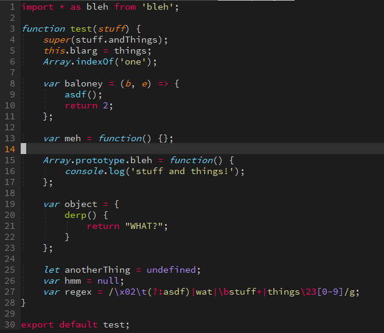

# Submonokai for Vim

`SubMonikai` is a refined Monokai color scheme for `vim` and `neovim`.

It's forked from the following excellent theme:

* [ErichDonGubler/vim-sublime-monokai](https://github.com/ErichDonGubler/vim-sublime-monokai)

There are several plugins used to enhance highlighting.
Where possible, the dependent plugins have been noted for
languages whose highlighting would otherwise be impossible to make equivalent
to Sublime. Conflicts with other plugins that I've used have been noted. You
will NOT get full fidelity with Sublime's highlighting if you use conflicting
plugins with this color scheme enabled.

## Installation

Use your favorite plugin manager! Alternatively, download the
[`colors/submonokai.vim`](https://raw.githubusercontent.com/scruffydan/submonokai-vim/master/colors/submonokai.vim)
file and move it into your `colors` folder.

## Usage

After installing this plugin via your favorite plugin manager, add the
following to your `vimrc`:

```viml
syntax on
colorscheme submonokai
```

## Terminal support

`SubMonokai` only support 256 colours in terminal. If you are using a
terminal which support truecolor like **iterm2**, enable the GUI color by
adding the following to your `vimrc`:

```viml
set termguicolors
```

Otherwise, use below setting to activate the 256 color in terminal

```viml
set t_Co=256
```

## Configuration

### Italics

By default italicized text is enabled in GUI (gVim), but in terminal it's not.
If you are using a font that support italics in terminal, add the following
to your `.vimrc`:

```viml
let g:sublimemonokai_term_italic = 1
```

## Language-specific configuration

In order to provide an experience with parity to Sublime, this color scheme
integrates with the highlighting groups that several language-specific plugins
specify. You will need to install these plugins in order to have Sublime-like
highlighting.

### Javascript

1. [`vim-javascript`](https://github.com/pangloss/vim-javascript) for the core
    language
2. [`vim-javascript-lib`](https://github.com/crusoexia/vim-javascript-lib), for
    popular Javascript libraries, like [underscore](http://underscorejs.org/)
    and [Backbone](http://backbonejs.org/).

#### Conflicts with Javascript

* [`cSyntaxAfter`](https://github.com/vim-scripts/cSyntaxAfter) conflicts on
    many operator groups.

## Screenshots




